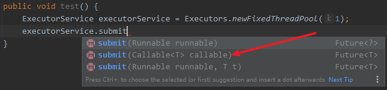

## 多线程
```java
// 接口
Runnable Callable<V>
// 类
Thread
```
### 创建线程个数固定为 i 的线程池
```java
public void test() {
    ExecutorService executorService = Executors.newFixedThreadPool(i);
    // 调用
    executorService.submit(Runnable runnable);
}
```
### 创建缓存线程池
```java
// 线程数量不固定, 由任务数量决定
public void test() {
    ExecutorService executorService = Executors.newCachedThreadPool();
    // 调用
    executorService.submit(Runnable runnable);
}
```
### 创建单线程线程池
```java
public void test() {
    ExecutorService executorService = Executors.newSingleThreadExecutor();
    // 调用
    executorService.submit(Runnable runnable);
}
```
### 关闭线程池
```java
// 执行完毕释放线程 shutdown()会等待线程执行完毕, shutdownNow()会立即强制释放线程
executorService.shutdown();

executorService.shutdownNow();
```
### Callable
```java
public void test() throws ExecutionException, InterruptedException {
    Callable<Integer> callable = new Callable<Integer>() {
        @Override
        public Integer call() throws Exception {
            return 6;
        }
    };

    // callable 需要使用 FutureTask 进行包装才可调用, FutureTask 实现了 Runnable 接口
    FutureTask<Integer> futureTask = new FutureTask<>(callable);

    Thread thread = new Thread(futureTask);
    thread.start();

    // 获取返回值, futureTask.get() 会阻塞线程, 直到 futureTask 中的线程结束
    Integer integer = futureTask.get();
    System.out.println(integer);
}
```
> 可以直接在线程池中使用



### 线程锁

#### 重入锁

> ReentrantLock

```java
private final Lock lock = new ReentrantLock();
```
```java
private final Lock lock = new ReentrantLock();

public void test() {
    // 获取锁, 如果没有获取到, 会阻塞, 直到获取到锁
    lock.lock();
    // 尝试获取锁, 不会阻塞, 获取到返回true, 否则返回false
    boolean b = lock.tryLock();
    // 释放锁
    lock.unlock();
}
```
#### 读写锁
> 

> 读锁可以并发执行， 写锁互斥  
>
> 写-写 互斥， 阻塞  
>
> 读-写 互斥， 阻塞  
>
> 读-读 并发

```java
private final ReentrantReadWriteLock lock = new ReentrantReadWriteLock();

public void test() {
    lock.readLock().lock();
    lock.readLock().unlock();
    lock.writeLock().lock();
    lock.writeLock().unlock();
}
```
