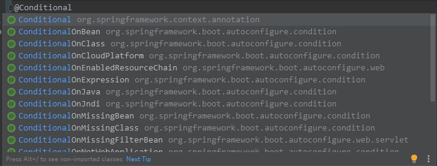

_**如果想使用 Spring Boot 的功能, 那么必须要注册为一个 Spring 组件**_
# 依赖管理 
Spring Boot 会自动根据 spring-boot-starter-parent 的版本选择依赖的对应版本号**
```xml
<parent>
  <groupId>org.springframework.boot</groupId>
  <artifactId>spring-boot-starter-parent</artifactId>
  <version>2.3.4.RELEASE</version>
</parent>
```
如果想修改为其他版本, 可以在 properties 标签中修改
```xml
<properties>
  <mysql.version>8.0.21</mysql.version>
</properties>
```
# 自动配置
## @Configuration 和 @Component的区别
@Configuration    单例
@Component       多例
## @SpringBootApplication
```java
@SpringBootApplication
// 相当于
@SpringBootConfiguration
@EnableAutoConfiguration
@ComponentScan
```
程序启动后默认的组件扫描范围是 **启动类所在包及子包** 
如果要扫描其他地方的组件
```java
// 单个位置
@SpringBootApplication(scanBasePackages = "com.xxx")
// 多个位置
@SpringBootApplication(scanBasePackages = {"com.xxx", "com.xxx"})

// 或者

@SpringBootConfiguration
@EnableAutoConfiguration
// 单个位置
@ComponentScan("com.xxx")
// 多个位置
@ComponentScan({"com.xxx", "com.xxx"})
```
## @Configuration
> Full Lite
> 该类本身也是一个组件

定义配置类, 该类中的组件默认都是单例模式
```java
@Configuration
// 相当于
@Configuration(proxyBeanMethods = true)
```
如果组件之间没有依赖关系, 则使用 Lite模式(性能稍好)
```java
@Configuration(proxyBeanMethods = false)
```
### @Bean
添加组件到容器, 默认id为方法名
```java
@Bean
public User user1() {
    return new User();
}
```
如果要修改组件id
```java
@Bean("user02")
public User user1() {
    return new User();
}
```
### @Impot
导入组件到容器
```java
// 会调用 User 与 Student 无参构造器将实例导入到容器
@Import({User.class, Student.class})
```
### @Conditional

**与组件注册注解一同使用** 
当该注解为true时, 才会注册组件, 否则不注册

****

```java
// 当组件 user01 存在时, Config才会被注册为组件
@ConditionalOnBean(name = "user01")
@Configuration
public class Config {
    
}
```
## @ConfigurationProperties
配置绑定注解
用于绑定 application 文件中的属性(yml与properties用法一致)
```java
@Component
@ConfigurationProperties(prefix = "xxx.xx")
```
如果该类没有注册为一个组件
```java
@ConfigurationProperties(prefix = "xxx.xx")
// 用在组件类上↓
// 开启xxx的配置绑定功能, 并且注册到容器
@EnableConfigurationProperties(xxx.class)
```
# Lombok
## @AllArgsConstructor
## @NoArgsConstructor
## @Data
## @ToString
## @EqualsAndHashCode
```java
@Data
@AllArgsConstructor
@NoArgsConstructor
@ToString
@EqualsAndHashCode
```


