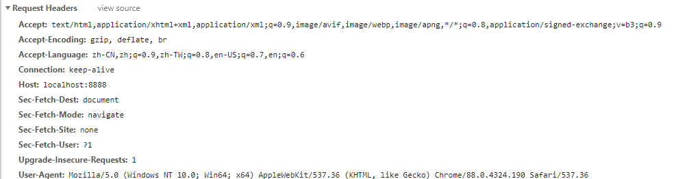

# 配置文件
## processor
属性绑定时的输入提示
```xml
<dependency>
  <groupId>org.springframework.boot</groupId>
  <artifactId>spring-boot-configuration-processor</artifactId>
</dependency>
// 只是方便于开发, 打包时应该排除
<build>
  <plugins>
    <plugin>
      <groupId>org.springframework.boot</groupId>
      <artifactId>spring-boot-maven-plugin</artifactId>
      <configuration>
        <excludes>
          <groupId>org.springframework.boot</groupId>
          <artifactId>spring-boot-configuration-processor</artifactId>
        </excludes>
      </configuration>
    </plugin>
  </plugins>
</build>
```
## 请求参数注解

### @PathVariable
一般用在Rest风格的请求上, 绑定参数, 可以单个获取或将所有参数放入Map中(只能是Map<String, String>), 可以同时使用
```java
@RequestMapping("/test/{carId}/{name}")
public Map<String, Object> test(@PathVariable("carId") String id, @PathVariable String name, @PathVariable Map<String, String> params) {
}
```
### @RequestHeader

获取请求头信息, 可以单个获取或将所有参数放入Map中(只能是Map<String, String>), 可以同时使用


```java
@RequestMapping("/test")
public Map<String, Object> test(@RequestHeader("User-Agent") String userAgent, @RequestHeader Map<String, String> headerParams) {
}
```


