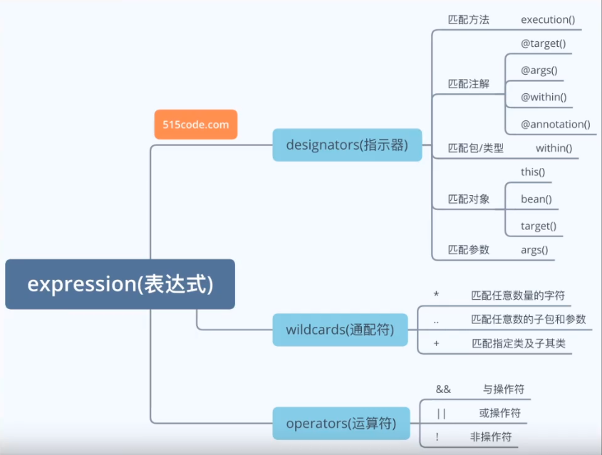

# 配置文件
## processor
属性绑定时的输入提示
```xml
<dependency>
  <groupId>org.springframework.boot</groupId>
  <artifactId>spring-boot-configuration-processor</artifactId>
</dependency>
// 只是方便于开发, 打包时应该排除
<build>
  <plugins>
    <plugin>
      <groupId>org.springframework.boot</groupId>
      <artifactId>spring-boot-maven-plugin</artifactId>
      <configuration>
        <excludes>
          <groupId>org.springframework.boot</groupId>
          <artifactId>spring-boot-configuration-processor</artifactId>
        </excludes>
      </configuration>
    </plugin>
  </plugins>
</build>
```
## 请求参数注解

### @PathVariable
一般用在Rest风格的请求上, 绑定参数, 可以单个获取或将所有参数放入Map中(只能是Map<String, String>), 可以同时使用
```java
@RequestMapping("/test/{carId}/{name}")
public Map<String, Object> test(@PathVariable("carId") String id, @PathVariable String name, @PathVariable Map<String, String> params) {
}
```
### @RequestHeader

获取请求头信息, 可以单个获取或将所有参数放入Map中(只能是Map<String, String>), 可以同时使用


```java
@RequestMapping("/test")
public Map<String, Object> test(@RequestHeader("User-Agent") String userAgent, @RequestHeader Map<String, String> headerParams) {
}
```

# 自定义注解

> 例

```java
@Retention(RetentionPolicy.RUNTIME)
@Target(ElementType.METHOD)
public @interface TestAnnotation {
    
}
```

## @Retention

声明该注解何时生效, 可选值

- `SOURCE` 
- `CLASS` 
- `RUNTIME`

```java
package java.lang.annotation;

public enum RetentionPolicy {
    SOURCE,
    CLASS,
    RUNTIME;

    private RetentionPolicy() {
    }
}

```

## @Target

声明要注解的目标是什么, 可选值

- `TYPE` 
- `FIELD` 
- `METHOD` 
- `PARAMETER` 
- `CONSTRUCTOR` 
- `LOCAL_VARIABLE` 
- `ANNOTATION_TYPE` 
- `PACKAGE` 
- `TYPE_PARAMETER` 
- `TYPE_USE`

```java
package java.lang.annotation;

public enum ElementType {
    TYPE,
    FIELD,
    METHOD,
    PARAMETER,
    CONSTRUCTOR,
    LOCAL_VARIABLE,
    ANNOTATION_TYPE,
    PACKAGE,
    TYPE_PARAMETER,
    TYPE_USE;

    private ElementType() {
    }
}
```


# AOP

## 通知可选参数

任何通知方法的第一个参数都可以是 `JoinPoint` (环绕通知是 `ProceedingJoinPoint` ，`JoinPoint` 子类) 或 `JoinPoint.StaticPart`

### JoinPoint

```java
public interface JoinPoint {  
    String toString();                  //连接点所在位置的相关信息  
    String toShortString();             //连接点所在位置的简短相关信息  
    String toLongString();              //连接点所在位置的全部相关信息  
    Object getThis();                   //返回AOP代理对象  
    Object getTarget();                 //返回目标对象  
    Object[] getArgs();                 //返回被通知方法参数列表  
    Signature getSignature();           //返回当前连接点签名  
    SourceLocation getSourceLocation(); //返回连接点方法所在类文件中的位置  
    String getKind();                   //连接点类型  
    StaticPart getStaticPart();         //返回连接点静态部分  
}
```

### ProceedingJoinPoint

```java
public interface ProceedingJoinPoint extends JoinPoint {
    public Object proceed() throws Throwable;
    public Object proceed(Object[] args) throws Throwable; // JoinPoint.getArgs() 可获取参数
}
```

### JoinPoint.StaticPart

```java
public interface StaticPart {
    Signature getSignature();       //返回当前连接点签名
    String getKind();               //连接点类型
    int getId();                    //唯一标识
    String toString();              //连接点所在位置的相关信息
    String toShortString();         //连接点所在位置的简短相关信息
    String toLongString();          //连接点所在位置的全部相关信息
}
```

### 或其他在通知注解上定义的参数

```java
@AfterThrowing(value = "testPointCat()", throwing = "e")
public void testAfterThrowing(JoinPoint joinPoint, Throwable e) {
}
```


## AOP注解

### @Aspect

把当前类标识为一个切面供容器读取

```java
@Aspect
@Component
public class TestAspect {

}
```

### @Pointcut

植入Advice的触发条件, 使用该注解的方法是用来作为标记, 因此方法内无需编写代码, 且必须是 `public void xxx(){}`

```java
// 所有使用了 TestAnnotation 注解的位置
@Pointcut("@annotation(com.mz.annotation.TestAnnotation)")
public void testPointCat() {}
```

```java
// *1: 返回值
// *2: 类名
// *3: 方法名
// ..: 任意参数
@Pointcut("execution(public * com.mz.controller.*.*(..))")
public void testPointCat() {}
```

> @PointCat excution表达式 👇

excution

- 修饰符 
  - `public`
  - `protected`
  - `private`
- **返回值**
- 包名
- **方法名**
- 异常



### @Before

前置通知, 在目标方法执行之前执行

```java
@Aspect
public class TestAspect {

    @Pointcut("execution(public * com.mz.controller.*.*(..))")
    public void testPointCat() {}

    @Before("testPointCat()")
    public void testBefore(JoinPoint joinPoint) {

    }
}
```

### @After

后置通知, 在目标方法执行之后执行, 无论是否抛出异常

```java
@Aspect
public class TestAspect {

    @Pointcut("execution(public * com.mz.controller.*.*(..))")
    public void testPointCat() {}

    @After("testPointCat()")
    public void testAfter(JoinPoint joinPoint) {

    }
}
```

### @AfterReturning

后置通知, 在目标方法执行完毕并且正常返回后执行

```java
@Aspect
public class TestAspect {

    @Pointcut("execution(public * com.mz.controller.*.*(..))")
    public void testPointCat() {}

    @AfterReturning("testPointCat()")
    public void testAfterReturning(JoinPoint joinPoint) {

    }
}
```

### @AfterThrowing

后置通知, 在目标方法执行并且抛出异常后执行

```java
@Aspect
public class TestAspect {

    @Pointcut("execution(public * com.mz.controller.*.*(..))")
    public void testPointCat() {}

    @AfterThrowing(value = "testPointCat()", throwing = "e")
    public void testAfterThrowing(JoinPoint joinPoint, Throwable e) {

    }
}
```

### @Around

环绕通知, 手动执行目标方法, 可在目标方法执行前后做操作

```java
@Around("testPointCat()")
public Object testAround(ProceedingJoinPoint joinPoint) throws Throwable {
    System.out.println("代码执行前");
    Object result = joinPoint.proceed();
    System.out.println("代码执行后");
    return result;
}
```

